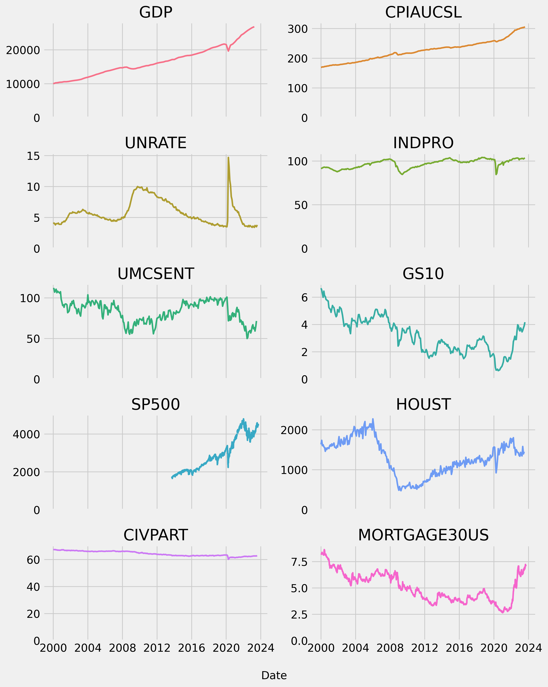

# Economic Data Analysis - FRED API

Basic analysis of economic indicators and stock prices. We use the **FRED** (Federal Reserve Economic Data) API with `fredapi` wrapper along with Yahoo finance `yfinance` python package.

This project contains a notebook `analysis.ipynb` with all the analysis. The analysis explore economic indicators available with the FRED API and includes:
- Plotting various historical economic indicators.
- Plotting indicators specific to housing.
- Looking at unemployment rates in US.
- Plotting a choropleth map of US states and unemploment rates.
- View historical performance of the S&P 500.
- Scrape wikipedia for companies and their GICS sector in S&P 500.
- Plot market cap for top companies.
- Plot GICS sectors with largest combined market caps.
- Plot candlestick plots for AAPL.

## Plots

Below are some plots generated by the analysis. View the notebook for full details and interactive versions of plotly figures.

#### Econonmic Indicator 2000-2024

#### Unemployment Rates

#### Housing Indicators

#### S&P 500 Price

#### S&P 500 Market Caps

#### AAPL Candlestick Pricing

